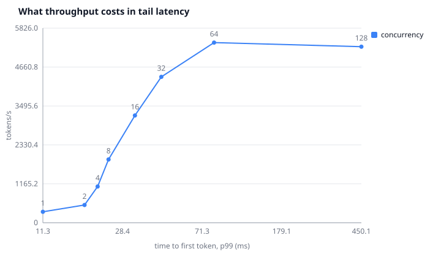
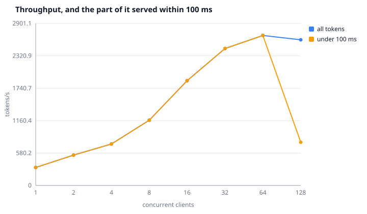
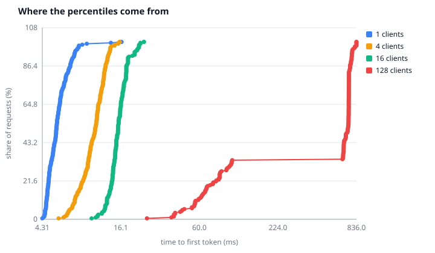

# braid

[](https://github.com/DanielPastor05/braid/actions/workflows/ci.yml)


A continuously batched inference server for
[cpp-ai-engine](https://github.com/DanielPastor05/cpp-ai-engine), written in Go.

Independent requests arrive whenever they arrive and are merged into a single
forward pass. A request that shows up mid-flight joins the batch at the next
step; a request that finishes leaves at the next step; and **nothing about the
batch reaches another sequence through the scheduler** - every row carries its
own history, its own temperature and its own seeded generator.

Whether the *arithmetic* keeps that promise is a separate question with a weaker
answer, and this page tries hard not to blur the two.
[It is measured, not guaranteed](#the-property-that-makes-it-correct-and-how-far-it-goes).

*Built with heavy AI assistance - [what that means](#how-this-was-built).*

| | |
|---|---|
| **Model** | the Transformer from `cpp-ai-engine`, **10 759 058 parameters**, 6 blocks, 384 wide, **1024-id context**, 146-symbol byte alphabet, 1.51 bits/char |
| **Card** | RTX 3060 Ti, CUDA 13.3, engine built with `-DENGINE_CUDA=ON` |
| **Throughput** | 322 tokens/s at one client, **2 686 at sixty-four** - median of three |
| **What batching buys** | **8.7x** in tokens, and [none of it past the knee](#the-part-of-it-anybody-is-waiting-for) in goodput |
| **Under real arrivals** | offered 300/s instead of 150, throughput *rises* to 2 963 and [goodput falls to 200](#the-harness-could-not-overload-anything-and-said-so-by-never-trying) |
| **Where a step goes at batch 64** | 20.0 ms model, 0.39 ms copy back, 0.10 ms sampling, 0.89 ms pipe |
| **Batching invariance** | 0 divergences in 25 000 draws, and the logits behind them [drift 2e-5](#a-zero-that-was-hiding-its-own-denominator) - which is the number that means something |
| **A worker killed mid-load** | 0 requests failed; workers hold no state |
| **A worker hung mid-step** | killed on a deadline and failed over; before that it stopped the server for good |
| **Landed upstream** | five PRs on the engine, all measured, one of them a correction to another |
| **The bug none of that caught** | every window was padded at the wrong end, and [no measurement here could have told me](#the-bug-no-number-could-have-shown-me) |
| **The optimisation that mattered** | [not computing the padding](#the-two-hundred-and-fifteen-positions-nobody-read): 5.9x, and only possible once the padding moved |
| **What it broke on the way** | it made a step small again, so [two dispatch floors came back to life on the wrong side](#the-thresholds-came-back-to-life-on-the-wrong-side) - worth another 1.66x at one client |
| **The one that did not** | a KV cache keyed by position could serve [2% of steps](#what-a-kv-cache-is-worth-here-and-why-this-server-cannot-use-one) - batching puts every row at a different position |
| **Against PyTorch** | same weights, same card, fp32 both sides: **[1.57x slower](#against-pytorch-on-the-same-card)** at the width it serves at, and **2.7x faster** on small work |

---

## What batching buys, and where it stops paying

192 generations of 30 tokens at each concurrency level. Every row is the median
of three sweeps, with the throughput range beside it.

| clients | forward passes | mean batch | tokens/s | TTFT p50 | TTFT p95 | wall ms | forward ms | kernels |
|---|---|---|---|---|---|---|---|---|
| 1 | 5 760 | 1.00 | 322 (316-328) | 5 ms | 8 ms | 2.92 | 2.82 | 177 |
| 2 | 3 109 | 1.85 | 543 (526-561) | 8 ms | 12 ms | 3.34 | 3.22 | 177 |
| 4 | 1 546 | 3.73 | 743 (727-754) | 10 ms | 14 ms | 4.92 | 4.82 | 177 |
| 8 | 756 | 7.62 | 1 168 (1160-1173) | 11 ms | 16 ms | 6.36 | 6.26 | 177 |
| 16 | 378 | 15.24 | 1 876 (1838-1882) | 15 ms | 19 ms | 7.99 | 7.68 | 177 |
| 32 | 191 | 30.16 | 2 453 (2404-2453) | 25 ms | 37 ms | 12.13 | 11.04 | 177 |
| 64 | 97 | 59.38 | **2 686** (2615-2728) | 42 ms | 62 ms | 21.67 | 18.51 | 177 |
| 128 | 94 | 61.28 | 2 608 (2568-2649) | **729 ms** | 780 ms | 22.65 | 19.60 | 177 |

Those are measured at a **1024-id context**, and they are the same numbers the
256-id model produced to within the noise: 322 against 321 at one client, 2 686
against 2 698 at sixty-four. **Quadrupling the context changed nothing here, and
that is the correct result** -- a step runs at the width of its longest row, the
load harness asks for thirty tokens, and forty-one positions is forty-one
positions whatever the model could have held. What the context changed is what a
key/value cache would have to hold, which is
[the reason it was raised](#what-the-context-is-for-and-what-it-costs).



**The turn is the whole picture.** Every point up to sixty-four clients buys
throughput for tens of milliseconds of tail. The last one buys nothing and costs
most of a second: the batch is as full as `MaxBatch` allows — 60.6 against a
limit of 64 — so the extra clients are not being served slowly, they are queuing.

**Batching is worth 8.7x here.** The kernel count is **177 on every row**: every
dispatch discontinuity this page used to have a section about is gone, and the
last one to go is [two sections down](#the-thresholds-came-back-to-life-on-the-wrong-side).

**One client needs 5 760 forward passes for 5 760 tokens, sixty-four need 98.**
Fifty-nine times fewer trips through the model for eight times the throughput.

### The part of it anybody is waiting for

Throughput counts every token the server produced. It does not ask whether
anybody was still waiting for it, and past the knee that difference is the whole
story:



**Goodput** is the same tokens counted only when the request that asked for them
saw its first token inside 100 ms. The two lines are the same line until the
queue starts, and then they part completely: at a hundred and twenty-eight
clients the server is producing 2 791 tokens a second and **serving none of them
inside the deadline**. A throughput figure alone would have called that the best
row in the table.

The threshold is a flag (`-slo-ms`) rather than a constant, because the right one
belongs to whoever is being served and not to the server.

### What a percentile is a summary of



A p95 is one number off one of these curves. The shape is what says whether the
tail is a few unlucky requests or the whole population moved — and at a hundred
and twenty-eight clients it is plainly the second: the curve does not have a
tail, it *is* the tail. Every request waited about the same long time, which is
what a queue looks like from the inside.

That multiplier has now fallen three times while the server got faster: 7.5x on
the small model, 2.5x on the big one, 12.3x once the padding stopped being
computed, 8.7x once the dispatch floors were lowered. **It measures how much
fixed cost there is left to amortise, not how good the batching is.** A project
that optimised for it would have been steering away from every real improvement
on this page.

Reproduce it:

```bash
go run ./cmd/braid -worker ./build/braid_worker.exe -model models/charlm
```

```bash
go run ./cmd/braidload -requests 192 -max-tokens 30 -repeat 3 -concurrency 1,2,4,8,16,32,64,128 -svg docs/img
```

The charts above come out of that command: the same sweep that printed the table,
so a figure and a curve never disagree about which run they came from.

---

### And where the ceiling actually is

The limit was 32 because 32 is a round number, so it was swept. 256 generations
of 30 tokens, median of three:

| | 64 clients | 128 clients | 192 clients |
|---|---|---|---|
| `-max-batch 64` | **3 000 tok/s, 45 ms** | 2 837, 680 ms | 2 940, 783 ms |
| `-max-batch 128` | 2 955, 47 ms | 2 756, 90 ms | 2 721, 145 ms |
| `-max-batch 192` | 2 983, 48 ms | 2 798, 83 ms | 2 725, 137 ms |

**A batch of sixty is a peak and not a plateau.** Raising the limit past 64 makes
the throughput *worse*: at a mean batch of 113 the server does 2 756 tok/s where
at 60 it does 3 000, because doubling the batch more than doubles the step —
19.3 ms becomes 40.5. Everybody in that batch waits the whole of it.

So `MaxBatch` is two knobs at once. Below the peak it buys throughput; at the
peak it stops; above it, it costs. **The default is now 64**, measured rather
than round, and that is where all three rows agree the card is happiest.

The earlier version of this section, taken before the dispatch floors were
lowered, put the peak at 2 750 tok/s and called it the card. It was the card
*plus* a step that went home to the host for its normalisations. The card turned
out to have another 9% in it.

---

### The harness could not overload anything, and said so by never trying

Every latency figure above comes from a **closed loop**: *n* clients, each
starting a new request when its last one finishes. A closed loop cannot overload
a server. The arrival rate is throttled by the completion rate, so as the server
slows down the load politely slows down with it, and every tail this page has
ever printed is the tail of a system that was never pushed.

Real traffic does not wait. `-arrivals` offers requests at a fixed rate with
exponential gaps — a Poisson process — and does not care whether the last one
came back. Against the mock backend, so this is about the scheduler and not the
model:

| offered/s | sent | completed | refused | tokens/s | goodput/s | TTFT p50 | mean batch |
|---|---|---|---|---|---|---|---|
| 150 | 1 064 | 1 064 | 0 | 2 573 | **2 556** | 35 ms | 45.9 |
| 300 | 1 794 | 1 480 | 314 | 2 963 | **200** | **1 382 ms** | 61.2 |
| 600 | 3 187 | 1 474 | 1 713 | 2 963 | 129 | 1 706 ms | 61.3 |
| 1 200 | 5 052 | 1 472 | 3 580 | 2 993 | 130 | 1 715 ms | 63.2 |

**Throughput goes up across the cliff.** 2 573 tokens a second at 150 offered,
2 963 at 300 — and in between, the goodput falls from 2 556 to 200 and the
median time to first token goes from 35 ms to 1.4 seconds. The server is
producing *more* tokens and serving almost nobody, and the number that has always
been quoted is the one that improved.

The completions flatten at about 1 474 in the window and stay there however much
is offered, which is the queue doing its job: past capacity the extra arrivals
are refused in single-digit milliseconds rather than admitted into a queue that
would answer them in a minute. **Refusals are a result here and not an error** —
a run that counted a 429 as a failure would report the well-behaved server as the
broken one.

```bash
go run ./cmd/braidload -arrivals 150,300,600,1200 -for 8s -max-tokens 20
```

---

## The two hundred and fifteen positions nobody read

The table above used to end at 354 tokens/s. The difference is one change, and it
is not a clever one.

The model's context is 256 ids, so the scheduler hands the worker a 256-id window
per sequence. A sequence is almost never 256 ids long: the load harness sends an
eleven-character prompt and asks for thirty tokens, so a row grows from 11 to 41
and the server's `mean_width` over a whole sweep is **29**. **The worker computed
all 256 positions anyway** — for every row, on every step — and then read one row
of the result per sequence.

Now a step runs at the width of its longest row. The rest was padding, and its
logits went nowhere.

| clients | before | after | |
|---|---|---|---|
| 1 | 146 | 183 | 1.25x |
| 2 | 211 | 268 | 1.27x |
| 4 | 293 | 657 | 2.24x |
| 8 | 340 | 1 119 | 3.29x |
| 16 | 346 | 1 736 | 5.02x |
| 32 | 373 | 2 194 | **5.88x** |

Same configuration both ways, 96 generations of 30 tokens, median of three. The
forward at a batch of thirty-two goes from 78.95 ms to 12.61 ms in that pair, and
to 12.15 in the wider sweep above.

**A shorter row is still correct at the batch's width.** Its own padding sits
between its length and the width, and the causal mask at the position being
sampled — `length-1` — reaches only `0..length-1`, which is all real ids. So the
width can be the maximum rather than something every row has to agree on, which
is what makes this usable at all under continuous batching.

**It was only possible because the padding moved.** With the padding at the front
the real ids were at the *end* of the row and there was no prefix to narrow to;
[the fix that put them at the front](#the-bug-no-number-could-have-shown-me) was
a correctness fix, and this fell out of it a day later.

One more thing came back with it. At one and two clients a step now launches
**140 kernels where a 256-wide step launched 176**: a narrow step is small work,
and the engine keeps small work on the CPU on purpose. That is the same dispatch
threshold this project [moved three times upstream](#what-the-small-model-was-hiding)
and then declared inert, arriving from the other direction — not because the
model is small, but because the step got small.

---

## The thresholds came back to life, on the wrong side

The engine keeps small work on the CPU on purpose. Three size floors decide:
`ENGINE_CUDA_MIN_FLOPS` for matmuls, `ENGINE_CUDA_MIN_ELEMENTS` for elementwise
operations, `ENGINE_CUDA_MIN_LAYERNORM` for normalisations. This project
[moved the first and made the third settable](#what-the-small-model-was-hiding),
three merged pull requests, and then a bigger model made all of them inert and
that section said so.

Not computing the padding undid that. A step at a batch of one over the
twenty-nine positions this actually serves is 11 136 elements, which is under
both remaining floors — so **every residual add and every normalisation went back
to the host, one PCIe round trip at a time.** The kernel count in the table above
said it out loud: 140 at one client where a wide step launched 176.

Three interleaved passes over the decode benchmark, then the server asked
directly:

| clients | as it shipped | both floors lowered | |
|---|---|---|---|
| 1 | 207 tok/s | **343** | 1.66x |
| 2 | 300 | **627** | 2.09x |
| 4 | 704 | 774 | 1.10x |
| 8 | 1 246 | 1 222 | — |
| 16 | 1 928 | 1 898 | — |
| 32 | 2 462 | 2 522 | — |
| 64 | 2 519 | 2 600 | — |

**1.66x at one client, 2.09x at two, and a wash from four upward** — the rows
where it does nothing are the rows where the batch was already big enough to
clear the floors on its own. The kernel count goes flat at 177 everywhere, and
every discontinuity this page has ever had a section about is gone.

Both defaults are now 1. There is one case it costs: below about four rows in the
batch — a one-token prompt served alone — it is roughly 40% worse, because
pushing 384 floats to the card is not worth the trip. That case does not occur in
serving, and it is why these are flags rather than constants.

**Note what this reverses.** An earlier sweep, on the 172 728-parameter model,
found that lowering these to 1 was *slightly worse*, and this page said so. It
was, then. The regime has changed twice since — a bigger model, then a narrower
step — and the floors have been right, then irrelevant, then wrong, without
anybody touching them. A threshold is a claim about the size of the work, and the
work here has changed size three times.

---

## What the small model was hiding

This repository spent most of its life serving a model of **172 728**
parameters over a 64-id context, and almost everything it concluded from that
was about the harness rather than about serving.

Every figure in the right-hand column was taken at the full 256-position width,
because that is what a step was when this was written. Five of them have since
moved again, for a reason that has nothing to do with the model, and they are
marked accordingly — [the section after this one](#the-two-hundred-and-fifteen-positions-nobody-read)
is where they went.

| | 172 728 params, 64 ctx | 10 758 289 params, 256 ctx |
|---|---|---|
| what batching buys | **7.5x** | **2.5x** → now 8.7x, and [that is not the improvement it looks like](#what-batching-buys-and-where-it-stops-paying) |
| where throughput saturates | 32 clients | **16 clients** → now 64, and it is a peak |
| forward, batch 1 -> 12 | 0.77 -> ~1.0 ms | **6.81 -> 30.36 ms** → now 2.7 at one, 6.0 at eight |
| kernels per step | 0 to 60, discontinuous | **176, flat** → now 177, flat at every size |
| PCIe crossings per step | 5 each way below batch 6 | **1 each way, always** |
| the pipe, batch 32 | 0.68 ms, 12% of a step | **below the noise floor** → now 2.2% |
| engine CUDA thresholds | two of them had to be moved | **both inert** → [live again, and wrong](#the-thresholds-came-back-to-life-on-the-wrong-side) |

This section is about the model change, and the model change is what the
left-to-middle comparison still describes correctly.

Read the middle row first. The old forward went from 0.77 ms at a batch of one
to about 1.0 ms at twelve: **nearly flat**, because there was not enough
arithmetic in a 172 728-parameter model for the batch size to matter. Every
millisecond was launch overhead, transfer and dispatch. The new one goes from
6.81 to 30.36 over the same range - about 4.5 ms of fixed cost and 2.15 ms per
additional sequence - which is a GPU doing work.

Everything else in the table follows from that one fact:

**The 7.5x was mostly an artifact.** Batching amortises fixed cost. When almost
all of a step *is* fixed cost, batching looks spectacular. Give the GPU real
work and the honest number was 2.5x - and it took a second look at what a step
was actually computing to find the rest.

**Both engine thresholds are now inert**, and that took three merged pull
requests to discover was necessary and one bigger model to discover was
temporary. `ENGINE_CUDA_MIN_FLOPS` kept a batch of one entirely on the CPU:
zero kernels, at a threshold of 4.2 MFLOP against a feed-forward of 2.4. At 384
wide over 256 positions that same matmul is 302 MFLOP, which clears it seventy
times over. `ENGINE_CUDA_MIN_LAYERNORM` refused every LayerNorm below a batch of
six, forcing five PCIe crossings a step. Its input went from n x 6 144 elements
to n x 98 304, which clears the floor at a batch of one.

The measurement above was taken **with the engine's own defaults**, no flags:
176 kernels and one crossing each way at every batch size from one to twelve. No
discontinuity anywhere.

**None of that work was wrong** - the thresholds really were miscalibrated for
serving, the pull requests are still merged and still help a small model. What
was wrong was believing the numbers described inference rather than describing a
model too small to be inferred from. The fix was not a better measurement. It
was a bigger model.

And the thresholds are not inert any more: a step narrowed to its longest row is
small work again, so at one and two clients the engine keeps part of it on the
CPU and the count drops to 140. The three pull requests went from necessary to
moot to load-bearing, without anybody touching them.

### And the pipe went under the noise, and came back

The process boundary cost 0.68 ms at a batch of thirty-two on the small model,
12% of a step. The subtraction that measures it is the wall clock minus what the
worker reports of itself, so it has no resolution of its own: on the big model it
went **negative** at small batches, -0.03 ms at one and -0.21 ms at eight, which
is two clocks disagreeing by a fraction of a millisecond over a step that took
eighty.

That was not a bug and it was not zero. It was the method running out of
resolution, and the code said so before it happened: the comment on `PipeMS`
promises the value is reported as measured rather than clamped, "because a
negative here means the measurement is wrong and that is worth seeing."

Now that a step is 12.6 ms rather than 86, the subtraction has something to
subtract from again: **0.17 ms at thirty-two clients, 1.4% of a step**, and 0.01
at one. The frame is the same 32 KB it always was. What changed is that the
number it is being compared against stopped being enormous.


---

## The bug no number could have shown me

Every measurement in this README was taken while the model was being fed
garbage, and every measurement was correct.

The scheduler hands the backend a fixed 256-id window per sequence. A sequence
shorter than that has to be padded, and until 2026-08-26 the padding went at the
**front**: real ids at the end of the row, zeros before them. That is the
conventional choice, and with a causal mask it is wrong.

A causal mask hides the *future*. Position `i` may attend to `0..i` and nothing
beyond. It says nothing about padding, because padding is not a concept the mask
has — so the row being sampled, the last one, attended to every pad id in front
of it as though it were context. And id 0 in this alphabet is a **tab**.

A five-character prompt therefore reached the model as 251 tabs followed by
`func `, and the model did the only reasonable thing with that. Both samples
below are a single line, wrapped here to fit, with newlines and tabs shown as
escapes:

```
prompt: "func "
int64\n\t\t\t\t}\n\t\t\t\t\t\t\t\t\t\t\t\t}()\n\t\t\t\t\t\t})\n\t\t\t\t\t}()\n\t\t\t\t\tin =
append(io.channex, want)\n\t\t\t\t\t\t\t\t\t\t\t\t\t\t\t\t\t\t\t\t\t\t\t\t\t\t\t\t\t\t
```

Same model, same weights, same seed, with the padding moved to the back and the
sampling told where the sequence actually ends:

```
prompt: "func "
index not of the output");\n    check_throws([&] { (void)A.slice(0, 0, 0); },
"positional_enconding throws");\n\n    // The one-thread engine` no is a decision
that is already the asserts a hang the\n
```

Still a 10 M-parameter character model trained for 24 minutes — it is not
*right*, it was never going to be right. But it is now answering the prompt.

The load harness sends `"the engine "`, eleven characters. **Every throughput
number this page used to quote was measured with the model reading 245 tabs.**
Those numbers were not wrong for what they measured — the tensor is the same
shape either way, the same 176 kernels ran, and a pad id costs exactly what a
real id costs. They were simply never about generating anything.

They did not survive long. Once the padding was at the *back* it was obvious that
nobody read its logits either, and
[not computing it at all](#the-two-hundred-and-fifteen-positions-nobody-read) was
worth 5.9x — so the fix that made the output mean something also made the numbers
that described it obsolete within a day.

**What makes this worth writing down is that nothing in the repository could
have caught it.** Twenty-eight tests, a measured divergence rate, percentiles, a
kernel counter, a chaos harness that kills processes under load — and a model
conditioned on 245 tabs satisfies every one of them. It is deterministic. It is
invariant to batch size. It fails over cleanly. Re-running the sweep above after
the fix gives the same counts to the digit — 2 880 forward passes at one client,
187 at sixteen, 176 kernels a step at every size — because the tensor is the same
shape either way and the padding costs exactly what text would have cost. The bug
lived in the one place none of the instruments pointed: whether the output
*meant* anything.

I found it by reading generated text for an unrelated reason.

The fix is the padding on the right, plus a per-row length in the frame so the
worker samples at position `length-1` instead of at the end of the window:

```
request   u32 magic 'B','R','D','6'      was BRD5
          u32 n
          i32 ids[n * kSeqLen]           right-padded now
          i32 length[n]                  new: real ids in each row
          f32 temperature[n]
          u64 seed[n]
```

The length cannot be inferred from the window — id 0 is a legal id — so it is a
field, and adding a field is what the version in the magic is for. Both sides
reject a length outside `1..kSeqLen` rather than clamping it: a length that
disagrees between the two ends means the frame is being misread, and sampling
some other position would answer the wrong question convincingly.

`TestWindowIsRightPadded` holds the scheduler to the new shape, including the
case that only exists now — the loop reuses one backing array across steps, so
with the padding at the back a short sequence lands on top of a longer one's ids
and the stale tail sits exactly where a backend that ignored `length` would read
it as context.

One consequence beyond correctness: a token's position no longer changes as the
sequence grows, up to the full 256. That is the precondition for a KV cache,
which is the next thing here — a cache keyed by position is worthless if every
step renumbers every token.

---

## The property that makes it correct, and how far it goes

Two claims live here and they are not equally strong. Keeping them apart is the
point of this section.

**The scheduler guarantees isolation.** Each sequence carries its own history,
its own temperature and its own seed, and the sampler is a fresh
`mt19937_64(seed)` per row. No row can read another's state, at any batch size,
on any hardware. That is structural.

**The arithmetic does not guarantee bit-identical logits.** A batch of *n* is a
different matrix product from a batch of one, the engine picks its matmul kernel
from the row count, and the sampler walks an inverse CDF — so a one-ULP
difference near a boundary flips a token and from there the sequences part.

So: **isolation is guaranteed, identity is measured.**

`TestBatchInvarianceDivergenceRate` measures it. The same window and the same
seed, sampled alone and then as one row of a batch of *n*, with the row's
position, its neighbours **and every row's length** redrawn every trial — so
what is measured is the batch rather than one arrangement of it, and rows that
sample at different positions are part of the arrangement.

That test got harder to pass than it looks, after the step
[narrowed to its longest row](#the-two-hundred-and-fifteen-positions-nobody-read).
A row used to be 256 positions wide whoever it sat next to. Now its width is the
batch's maximum, so **the shape of the tensor a sequence is computed in depends
on its neighbours' lengths** — the row runs at its own width alone and at
somebody else's in company, which is a different matmul and can be a different
kernel. The rate below was re-measured after that change, and it did not move.

| batch | trials | diverged |
|---|---|---|
| 2 | 5 000 | 0 |
| 4 | 5 000 | 0 |
| 8 | 5 000 | 0 |
| 16 | 5 000 | 0 |
| 32 | 5 000 | 0 |

Zero observations is not a rate of zero. By the rule of three, 0 in 25 000 puts
the 95% upper bound at **1.2 × 10⁻⁴** — about one flipped token in eight
thousand at worst, and possibly none at all. Raise `BRAID_DIVERGENCE_TRIALS` and
the bound tightens; the run above took sixteen minutes.

The test asserts a **ceiling of 1%**, not zero, deliberately. Nothing in the
engine promises the same reduction order at two batch sizes, so a test demanding
identity would assert a property the code does not have and would eventually
fail for being right. What it catches is the rate climbing.

### A zero that was hiding its own denominator

Counting flipped tokens has a blind spot, and it took a while to see it. The
sampler walks an inverse CDF, so a difference in the last bits only changes the
answer when it happens to fall across a boundary. **Counting flipped tokens
therefore measures the probability that the noise mattered — which depends on the
shape of the distribution — and not the noise.** A model with a confident peak
would report zero divergences while carrying any amount of drift underneath.

So the logits get compared too. Same window, same seed, alone and then as one row
of a batch of *n*, every logit of the sampled row:

| batch | max absolute | max relative | tokens differing |
|---|---|---|---|
| 2 | 1.907e-05 | 1.517e-05 | 0/40 |
| 4 | 1.717e-05 | 1.281e-05 | 0/40 |
| 8 | 2.766e-05 | 2.110e-05 | 0/40 |
| 16 | 1.481e-05 | 1.481e-05 | 0/40 |
| 32 | 1.955e-05 | 1.943e-05 | 0/40 |

**About 2 × 10⁻⁵ relative, and it does not grow with the batch.** That is a
better statement about invariance than a count of zero, and it explains the zero:
float32 carries about 1e-7 of relative precision, six blocks of differently
shaped matmuls accumulate it, and the result is a gap far narrower than the
distance between the top two logits — so the CDF boundary is rarely anywhere
near.

Getting the logits out is a diagnostic and not a protocol change:
`BRAID_EMIT_LOGITS` makes the worker append the sampled rows after the timings.
Serving does not want them — *n* × vocab floats a step that nobody reads — so it
costs the hot path nothing and stays off.

`TestBatchingDoesNotChangeOutput` is the same property against the mock, whose
next token is a hash of the sequence's real ids and its length: bit-exact by
construction, and it catches every scheduler bug — a crossed row, a window built
from the wrong end, the wrong sequence advanced. It deliberately does *not* hash
the padding, for the same reason the model cannot see it: a mock that hashed the
whole row would go on passing if the length were ever threaded through wrong.

Both tests also assert the sequences really did share steps. An earlier version
of the second passed while batching nothing at all: the backend was fast enough
that each request finished before the next arrived, mean batch 1.00, invariant
trivially satisfied, nothing proved.

---

## What a KV cache is worth here, and why this server cannot use one

The plan was to add a key/value cache and then measure it. Measuring first said
the win was a third of what the arithmetic promised. Building it said the server
cannot use it at all. Both of those are worth more than the cache would have
been.

### First: what it could win

The model recomputes every position it is given, and the sampler reads one row of
the result. A cache would keep the keys and values already computed and run the
projections and the feed-forward over the single new position — on paper a 256x
cut, since attention is about a tenth of the FLOPs at this geometry and the rest
is per-position.

`braid_bench_decode` runs the same weights over a window of *S* positions instead
of 256, with every operation forced onto the card so the sweep compares window
sizes rather than execution paths:

| batch | 256 positions | window ≤ 64 | ceiling |
|---|---|---|---|
| 1 | 6.41 ms | 2.33 ms | 2.7x |
| 8 | 21.26 ms | 2.30 ms | 9.3x |
| 32 | 83.83 ms | 2.52 ms | 33.3x |

**The floor is the same ~2.4 ms at every batch size.** It is 177 kernel launches,
and a launch does not care how much work it carries: 2.4 ms over 177 is 13 µs
each. A cache makes the kernels smaller, not fewer. So the win is 33x to a full
batch, 2.7x to a single client, and 256x to nobody.

### Then: that ceiling was measured against a baseline that no longer exists

Those rows compare a 256-position step to a 1-position step. **This server does
not run 256-position steps any more** — it runs at the width of the longest
sequence in the batch, and `/stats` puts the mean of that at **29** under the
load harness (re-measured at 29.9 after the context went to 1024 — the model got
four times wider and the served width did not move, which is the whole point of
the next section). The honest remaining win is 29 → 1, not 256 → 1: interpolating
the same table between its 16- and 32-position rows, roughly 4x at a batch of
thirty-two rather than 33x.

**That 29 is a fact about the harness, not about the server.** It asks for thirty
tokens; a client that asks for nine hundred gets a mean width of 453 and a very
different machine.

It grows with the generation, and that sentence used to end here as a guess.
It is now measured, and it is the strongest argument on this page.

### Ask for nine hundred tokens and the server falls over

The load harness asks for thirty tokens, so a row *ends* about forty positions
wide — mean 29.9 over the whole generation — however large the context is.
Asking for **nine hundred** is the regime the 1024 context was raised for, and it
is a different machine:

| clients | tokens/s | forward ms | mean batch | | at 30 tokens |
|---|---|---|---|---|---|
| 1 | **100** | 9.77 | 1.00 | | 322 |
| 4 | 143 | 27.20 | 3.99 | | 743 |
| 16 | **159** | 98.65 | 15.98 | | 1 876 |

Mean width 453 rather than 41. Two things happen at once, and the second is the
one that matters:

**Throughput drops 11.8x** at sixteen clients — 1 876 tokens/s to 159 — because
every step is recomputing four hundred and fifty positions to produce one token.

**And batching stops paying.** Sixteen clients buy **1.59x** the throughput of
one (100 → 159), against 5.8x at short generations. The forward goes 9.77 → 27.20
→ 98.65 ms: **ten times the work for sixteen times the batch**, which is what
saturation looks like. There is no fixed cost left to amortise, because the cost
is no longer fixed — it is quadratic in a window that keeps growing.

This is the measurement the whole memory phase needed. The 33x ceiling earlier on
this page was divided by a synthetic 256-position step that serving never ran;
this one divides a step the server **actually performs**, at a width it actually
reaches. Against `braid_bench_decode`'s ~2.4 ms floor plus roughly 0.35 ms of
attention over a 453-position cache at this batch, a cached step would be about
2.8 ms against the 98.65 ms measured — a **~36x ceiling**, and this time the
denominator is a serving number rather than waste.

It is still a ceiling and still not a win: nothing here has a per-row cache yet.
What changed is that the reason to build one is no longer arithmetic about a
hypothetical workload. It is a workload this server takes eleven times longer to
serve.

One honest wart in that table: `pipe ms` reads −0.09 and −0.18, which is the
component timers summing a fraction of a percent above the wall clock at a step
this long. It is timer granularity, not a negative duration, and it is left in
rather than clamped because a clamped zero would hide the same noise everywhere
else.

That is the fourth number this page has had to take back, and the cause is the
same each time: **a ratio is only as honest as its denominator.** The benchmark
was correct and the conclusion drawn from it was not, because the baseline it
divided by was itself waste.

### And then: a position-keyed cache can serve 2% of steps

A cache is indexed by position, and one write offset is shared by the whole
batch — every row appends its new key at the same slot. That works only if every
row is at the same position.

Continuous batching is the practice of making sure they are not. Requests arrive
when they arrive, so at any moment the batch holds a sequence on its third token
next to one on its two-hundredth.

The scheduler counts it, because it already knows every row's length:

| load | 4 clients | 16 clients | 32 clients |
|---|---|---|---|
| every request identical | 14.3% | 2.7% | 2.3% |
| prompt length and token count varied | 0.4% | 2.1% | 2.1% |

**Around two percent of steps have every row at the same position** — and the
first row of that table is the flattering one, because it is the load harness
sending every client the same prompt and the same token count, which is not a
property of serving but of the harness.

So the cache is built, it is correct, it is tested, and it would apply to one
step in fifty. It went upstream anyway —
[`Tensor::copy_into`](https://github.com/DanielPastor05/cpp-ai-engine/pull/5) and
[`nn::KVCache`](https://github.com/DanielPastor05/cpp-ai-engine/pull/6), both
merged, with a parity test that decoding one position at a time equals one
forward over all of them — because the engine is a library and a library's users
are not all continuously batched servers.

**What a server like this one actually needs is a per-row write offset**: each
sequence's cache growing at its own rate, in blocks, with a table saying where
each row's blocks live. That is PagedAttention, and it is the next phase rather
than a footnote to this one. The useful thing is that the reason for it is now a
measurement — two percent — rather than a citation.

### What the context is for, and what it costs

The 256-id context was raised to **1024** for exactly one reason: at 256 a cache
is 300 MB and the machine does not care. `internal/kvmem` does that arithmetic
rather than asserting it -- 6 blocks x 6 heads x 64 head-dim x 4 B x 2 for K and
V is 18 KB a position, so:

| | at 1024 positions |
|---|---|
| one sequence | **18.0 MB** |
| sixty-four sequences | **1.12 GB** |
| what a 4 GB budget buys | 14 563 blocks of 16 -- **227 sequences** at full context |

On an 8 GB card holding 43 MB of weights, 1.12 GB is the difference between a
detail and the thing that decides who gets admitted. That is the premise the
whole memory phase needs, and at 256 it was false.

**Blocks, and what they waste.** A fixed block size means the last block of every
sequence is partly empty, and that waste is the price of not fragmenting the
pool. Measured over a realistic spread of lengths:

| block size | wasted | blocks held |
|---|---|---|
| 4 | 0.9% | 232 |
| 16 | **5.7%** | 61 |
| 32 | 10.2% | 32 |
| 64 | 15.4% | 17 |

Sixteen is the default: under six percent lost, and a quarter of the block table
that four would need to describe the same sequences.

**Eviction, and the trade nobody states.** When the pool is full something has to
give, and the three obvious policies are not ordered -- they trade victims against
recomputation, which is the cost of bringing an evicted sequence back:

| policy | victims | positions to recompute |
|---|---|---|
| longest | 2 | 240 |
| newest | 2 | 240 |
| **shortest** | **4** | **160** |

Taking the shortest evicts twice as many sequences and recomputes a third less.
Which one is right depends on whether the server is optimising for how many
clients are disturbed or for how much work is thrown away, and the point of
measuring it is that the answer is not obvious from the names.

Two properties are tested rather than assumed, because both are the difference
between eviction and collapse: **the sequence that triggered the eviction is
never its victim** (a policy that can choose the requester will, under pressure,
spend its whole time evicting whoever just arrived), and **a request that cannot
be satisfied by evicting everything is refused rather than emptying the pool**
first and failing anyway.

### The memory that is already there, and the diagnosis that was wrong

Before any cache exists, the 1024-id context put a limit on this card that
nothing in the admission path can see.

`braid_bench_decode` out to the full context, with every operation forced onto
the device:

| batch | window 1 | 256 | 512 | 1024 | vs full |
|---|---|---|---|---|---|
| 1 | 6.53 ms | 16.25 | 24.52 | **50.67** | 7.8x |
| 8 | 6.65 | 57.74 | 128.63 | **348.12** | 52.3x |
| 16 | 6.15 | 111.05 | 258.72 | **680.16** | 110.6x |
| 32 | 7.09 | 215.12 | 506.16 | **2 763.36** | 389.9x |

Doubling the window from 512 to 1024 costs between 2.1x and 2.7x on every row —
except the last, which costs **5.5x**. That is not arithmetic, it is the card: at a batch of thirty-two and a
full window the process sits at 7 854 MiB of 8 192.

Watched over a long run of decodes at *varying* widths — the arrangement
continuous batching actually produces — one worker climbs from 1.6 GB after
warmup to a peak of **6 825 MiB**, alone on the card. Nothing is leaked; that is
what the activations of a batch of thirty-two at a thousand positions cost.

**And here is a diagnosis this page got wrong, kept because the wrong turn is the
useful part.** The engine sets the CUDA memory pool's release threshold to
`UINT64_MAX` — never give memory back — with a comment claiming *"the pool still
bounds itself: it reuses rather than grows"*. That claim was measured on MNIST
training, where every iteration asks for the same buffer. Varying widths reuse
badly, so the retained pool looked like the obvious culprit.

It was tested rather than assumed: the threshold was made finite at 1 GiB and the
same run re-measured. **The sampled peak went from 6 825 MiB to 7 530 — it did
not fall, it rose.** Bounding what the pool retains changed nothing worth having,
which means almost none of that memory was retained: it is *live* activation, and
the engine's comment was right where the hypothesis was wrong.

(Both figures are the largest of a sampled series rather than a true peak, so the
rise is as likely to be sampling as effect. What is not in doubt is the direction
the change was supposed to move it, and it did not.)

The change was reverted rather than kept for looking like progress. The only
thing that bounds live activation is admitting fewer or narrower rows — which is
what `internal/kvmem` is for and what the scheduler still cannot do.

The immediate casualty is the test suite: `go test ./internal/...` runs packages
in parallel, three of them start real workers, and two processes wanting 6.8 GB
do not fit on 8. Hence [`-p 1`](#building-it), and a symptom that reads like a
hang rather than an out-of-memory.

### The cache is built, and what it costs is the room you gave it

`CharModel::forward_cached` exists now: the engine's per-row fill, per-row mask
and per-row write offsets assembled into this model, with the positional
encoding gathered per row instead of sliced. `braid_test_cached` checks the only
property a cache has -- that decoding through it gives what recomputing gives --
in three arrangements, the last of which is five rows at five different
positions prefilled to five different depths. All three agree to **0.000e+00**.
Not within tolerance: the same floats.

Then it was measured against the step it replaces, and the answer was not the
one the arithmetic promised. I expected something like 26x. What came back:

| batch | history | capacity | uncached | cached + gather | speedup |
|---|---|---|---|---|---|
| 16 | 128 | 256 | 22.49 ms | 6.48 | **3.5x** |
| 16 | 128 | 512 | 22.31 | 10.12 | 2.2x |
| 16 | 128 | 1024 | 22.38 | 17.62 | **1.3x** |
| 32 | 453 | 512 | 180.31 | 19.20 | **9.4x** |
| 32 | 453 | 1024 | 182.05 | 30.87 | 5.9x |
| 8 | 128 | 1024 | 12.39 | 11.21 | **1.1x** |

**Read the first three rows together: the history is the same in all of them.**
Only the capacity changes, and the cost doubles with it. A cached forward attends
over the whole capacity rather than over the part filled so far, because slicing
the cache down to its length would copy it every step -- which is the cost the
cache exists to avoid. So what a step costs is set by the room *allocated*, not
by the history *held*.

Allocate the full context to hold four hundred positions and you pay for the
full context, every step, forever. That is the last row: a cache that wins 1.1x
is not a cache, it is a memory bill.

**This is the measured argument for a block table, and it was an assertion until
now.** Rounding a reservation up to a block instead of up to the context is
worth 5.9x → 9.4x at the batch and history this server actually reaches — a 60%
improvement from allocation alone, with no kernel touched. `internal/kvmem`
allocates in blocks of sixteen for [under six percent
waste](#what-the-context-is-for-and-what-it-costs); 453 positions round to 464
rather than to 1024, and the 512 row above is the nearest thing measured to it.

The gather is the cheap part, which is the one thing that did go as predicted:
0.62 ms at batch 16 and capacity 512, against a 9.47 ms cached step. The plan
guessed "about a quarter of the step, and then the fused attention kernel has a
baseline to beat"; measured it is a tenth, and the baseline to beat is the
attention over capacity rather than the movement.

**None of this is wired into the serving path yet, and saying otherwise would be
the fifth correction on this page.** It is arithmetic and a block allocator with
tests; what it is waiting for is the per-row cache in the worker, which is
waiting on three engine pull requests --
[#7 `copy_into_rows`](https://github.com/DanielPastor05/cpp-ai-engine/pull/7),
[#8 a fill and a mask per row](https://github.com/DanielPastor05/cpp-ai-engine/pull/8),
[#9 a device path for `select_rows`](https://github.com/DanielPastor05/cpp-ai-engine/pull/9)
-- stacked in that order and all green.

```bash
go test ./internal/kvmem/ -v
```

```bash
cmake --build build --target braid_bench_decode
```

```bash
ENGINE_CUDA_MIN_FLOPS=1 ENGINE_CUDA_MIN_ELEMENTS=1 ENGINE_CUDA_MIN_LAYERNORM=1 ./build/braid_bench_decode models/charlm 100
```

One more caveat on the first table, in the direction that costs it: a cached
decode is not exactly a forward at *S*=1, because its attention still reads the
whole cache. That is about 0.4 ms at a batch of thirty-two against a 2.5 ms
floor. The table is a ceiling, and a close one.

---

## Against PyTorch, on the same card

This page compared itself to nothing for its whole life. `cpp-ai-engine` opens
with *"1.70× slower than PyTorch, and that is the number worth publishing"*, and
braid had no equivalent. Here it is.

`bench/reference/` holds the same model in PyTorch — 6 pre-norm blocks, 384 wide,
6 heads, sinusoidal positions — **reading the same weights**, straight out of
`models/charlm.bin`. Not a reimplementation trained separately, which would
compare two models. The engine's checkpoint format is self-describing enough to
parse in thirty lines of `struct`, and that is the only reason this comparison is
worth anything.

### Parity first

A reference implementation that is faster and subtly different is not a
reference, it is a second model. The ways to get there are ordinary: pre-norm
written as post-norm, a `Linear` loaded without its transpose — which on a square
matrix, and every attention projection here is square, loads cleanly and computes
nonsense — the positional encoding's pair index off by an integer division. All
three produce plausible logits.

So `parity.py` runs first, against `braid_worker` over its own protocol rather
than against a C++ program written for the occasion. Mixed-length batches, a
temperature low enough that the sampler lands on the argmax, and the comparison
is which token each row picks:

```
500 rows compared over 200 batches
argmax disagreements: 0
```

Re-run against the retrained 1024-id model rather than carried over: same 500
rows, same zero. It is the check that says the context change broke nothing, and
it is also where the parameter count in the table at the top comes from — the
reference reports `10,759,058 parameters, 146 symbols` after parsing the
checkpoint itself, so the two numbers cannot drift apart without this failing.

### Then speed

fp32 on both sides, TF32 pinned off. Same card, same weights, one process at a
time, both synchronising after every forward, both warmed three times. Not
server-against-server: braid's scheduler and PyTorch's absence of one would be
most of the difference, and the question here is the arithmetic underneath.

Three passes each, **interleaved** so that neither gets the cold card or the hot
one to itself, medians below. The engine's column has every operation dispatched
to the GPU rather than left to its size thresholds, so that the two columns are
comparing arithmetic and not dispatch policy.

| batch | window | engine | PyTorch | |
|---|---|---|---|---|
| 1 | 1 | **2.44 ms** | 6.56 ms | engine 2.68x faster |
| 1 | 32 | **2.52 ms** | 6.45 ms | engine 2.56x faster |
| 1 | 256 | 6.68 ms | **6.48 ms** | even |
| 8 | 4 | **2.65 ms** | 7.56 ms | engine 2.85x faster |
| 8 | 256 | 22.41 ms | **10.26 ms** | engine 2.18x slower |
| 32 | 1 | **2.70 ms** | 5.56 ms | engine 2.06x faster |
| 32 | 16 | 7.77 ms | **6.55 ms** | engine 1.19x slower |
| 32 | 32 | 11.20 ms | **7.14 ms** | engine **1.57x** slower |
| 32 | 64 | 20.06 ms | **9.08 ms** | engine 2.21x slower |
| 32 | 256 | 81.16 ms | **35.24 ms** | engine 2.30x slower |

**The engine wins on overhead and loses on kernels**, and the crossover is
between sixteen and thirty-two positions at a batch of thirty-two.

Look at PyTorch's column first: it is **flat at 5.5 to 7 ms** from a single
position at a batch of one all the way to sixteen positions at a batch of
thirty-two. That is not compute, it is the floor — a Python interpreter
dispatching a hundred and seventy-odd operations per forward, one at a time. The
engine has the same shape of floor and it sits at **2.4 to 2.7 ms**, because C++
has no interpreter to pay for. Below the crossover the engine is not computing
faster, it is simply cheaper to *ask*.

Above it, cuBLAS wins and it is not close: 35 ms against 81 at the full context.

### The number that counts

**braid serves at a mean width of 29 and saturates at a batch of about sixty.**
The nearest measured row is a batch of thirty-two over thirty-two positions, and
there **the engine is 1.57× slower than PyTorch.**

`cpp-ai-engine` measures **1.70×** for a completely different workload — a
convolutional network training on MNIST, not a transformer decoding — with TF32
pinned off there too. The same engine, the same card, two workloads with nothing
in common, and the ratio agrees to within eight percent. Neither number was
fitted to the other; this one was measured today and that one months ago.

That consistency is the useful part. A hand-written CUDA backend that lands
within a factor of two of cuBLAS across two unrelated workloads is a backend
whose remaining gap is *the matmul kernel*, not a pile of accidents — and the
step breakdown says the same thing: at a batch of thirty-two the model is 12.2 ms
of a 12.6 ms step, with the copy back at 0.18 and the pipe at 0.17.

```bash
python -m pip install torch --index-url https://download.pytorch.org/whl/cu124
```

```bash
python bench/reference/parity.py models/charlm --trials 200
```

```bash
python bench/reference/speed.py models/charlm --repeats 100
```

---

## Killing a worker under load

`-workers N` puts a pool behind the scheduler. The scheduler does not know: a
`Pool` is a `Backend` like any other, and nothing in `internal/sched` changed to
support this.

That is not luck. **A worker holds no state between steps.** The sequence's
history lives in the scheduler and every step sends the whole 256-id window, so
there is no cache to rebuild and no session to migrate — a step that fails on
one worker is asked of the next, with the same bytes, and the caller cannot
tell.

512 generations of 60 tokens at sixteen clients, twice, against the same server:

| | requests | tokens/s | TTFT p50 | TTFT p95 | failed |
|---|---|---|---|---|---|
| nothing dies | 512 | 1 466 | 21 ms | 26 ms | 0 |
| one worker killed mid-run | 512 | 1 500 | 18 ms | 25 ms | **0** |

`Stop-Process -Force`, not a signal: a signal would exercise the shutdown path,
which is not the path in question. One death, one failover, one restart, and the
tail did not move. The killed run came out marginally *faster*, which is the
noise band saying the difference is not measurable.

The load is 512 requests rather than the 128 this used to run, and that is worth
a sentence. The first attempt after the step got faster reported a beautifully
clean result and the harness refused it: **`THIS RUN PROVES NOTHING: the pool
never saw a death`**. The whole run now finishes in four and a half seconds, so a
kill fired at the four-second mark landed after the last step the victim would
ever be asked for. The check exists because an earlier version of this harness
killed a stray worker from a previous run and reported a clean result, and it
caught its second distinct way of proving nothing.

**The blast radius of a worker dying is exactly one step**, because the
scheduler advances the batch one step at a time and that worker was holding
exactly one. This is a consequence of the design rather than a recovery
mechanism that had to be engineered: there was nothing to lose, so nothing was
lost. It is also the property a KV cache would spend, which is why the roadmap
says to measure the trade rather than assume it.

### What a pool is not

**It is not capacity.** The scheduler steps serially, so at any instant one
worker is computing and the rest are idle — three workers reach the same
throughput as one, which the table above shows by matching the single-worker
figure to within noise. The pool buys redundancy and nothing else on one card.

---

## The failure that a dead process cannot stand in for

A worker that dies closes its pipe and the next read fails at once. That is the
easy failure, it is what the chaos tests kill, and it was the only one this
server survived.

A worker that is **alive and silent** — a wedged kernel, a driver reset that
leaves the process up — holds the pipe open, and a pipe read has no timeout of
its own. `Backend.Step` had no context and no deadline, so that read blocked the
scheduler's single goroutine forever: every request behind it stalled, every new
one queued, and `/healthz` went on answering that the server was fine. It was
the worst bug in this repository and nothing in it could have found it, because
every test killed processes rather than freezing them.

`Step` now takes a context and each worker enforces its own ceiling. On expiry
the process is killed rather than abandoned, and that is not tidiness: the
protocol carries no request identifier, so a worker that answered late would
answer the *next* step with this step's ids and nothing could notice. Killing it
turns a hang into a death, which the pool already knows how to handle.

Reviewing that fix found the same bug twice more, one layer down. The reap after
the kill waited on its goroutine without a bound — correct exactly when the kill
lands, and the original hang again when it does not. And `Close` waited on
`cmd.Wait` without a bound, which matters because `retire()` closes from the
scheduler's own goroutine, and a worker wedged in a kernel call is not reading
its stdin to be asked to stop. Both are bounded now.

Three tests hold it, all in CI, none needing a GPU. The fake worker grew a
`hang` mode: read the frame, answer never, stay alive. Writing it took two
attempts — the first parked in `select{}`, which the Go runtime calls a deadlock
and answers by killing the process, producing the immediate EOF the mode existed
to avoid. The assertion caught it. A weaker one would have passed.

---

## Why the model runs in another process

`nvcc` on Windows compiles only through MSVC. cgo links only through a
GCC-compatible toolchain. A C++ static library from one is not linkable by the
other, so the engine cannot be linked into the Go binary at all.

A pipe has no ABI to disagree about. `braid_worker` is a C++ process that owns
the model and answers step requests over stdin and stdout in a fixed binary
frame; the Go side writes `n` windows and reads `n` ids back, plus the timings
and counters it needs to say where the step went.

It cost about 12% of a step on the small model and
[1.4% now](#and-the-pipe-went-under-the-noise-and-came-back), having spent a
while under the noise floor in between. What falls out of the boundary is the
shape the pool needs: a worker is a thing that can be killed.

---

## Three decisions worth the words

**The queue rejects rather than grows.** Past `-queue` the answer is HTTP 429
with a `Retry-After`. An unbounded queue does not make a server faster; it
converts a throughput problem into a latency problem and reports neither.

**Deadlines are checked at admission, not at completion.** A caller that sets
`max_wait_ms` and waits longer is rejected *before* the first forward pass.
Rejecting early costs nothing; discovering it after the GPU has paid for the
work wastes the work.

**A stream's buffer is exactly `max_tokens` long, so the loop's send can never
block.** The first version capped it at 32 tokens and killed whoever fell
behind, which punished a caller for being briefly behind — HTTP clients are
bursty. Sizing the buffer to the most a request could ever produce removes the
question: a caller that reads nothing at all still completes, buffered, paying
for itself in memory and costing its batch neighbours nothing.

And one that is only visible in what a prompt costs: **only the last 256 ids of
a prompt are kept**, because `window()` takes the tail and the model has no other
context. Keeping the rest was a caller-controlled allocation with no purpose — at
a 1 MiB body limit and a queue of 256, up to a gigabyte of ids nothing would ever
read. Copied rather than resliced, since `history[len-n:]` would have fixed the
arithmetic and none of the memory.

---

## What the server says about itself

`/stats` reports the scheduler's counters, the step breakdown when the backend
can produce one, the pool when there is one, and **its own latency** as
percentiles over the last 1 024 completions.

Two of the counters are there for an argument rather than for operations.
`mean_width` is the positions a step actually ran over — the longest row, not the
model's context — and `aligned_step_share` is the fraction of steps whose rows
were all at the same position. The second is what a position-keyed key/value
cache could serve, and
[measuring it is what settled that this server cannot use one](#what-a-kv-cache-is-worth-here-and-why-this-server-cannot-use-one).

That last part was missing for longer than it should have been. A comment in
`stats.go` said *"a server that computes its own averages is a server that hides
its tail"* — and the file it was written in exposed counters and a mean batch
size. The percentiles lived only in the load harness, which meant this server
could describe its own tail only while somebody was benchmarking it, which is
exactly when a tail matters least.

A window rather than a lifetime, because a p99 over every request since boot is
a number an hour of good service cannot move and an incident an hour ago never
leaves. Rejections are kept out of it: they have no time to first token, and
counting them as zero would drag every percentile down precisely when the server
is overloaded.

---

## How this was built

With heavy AI assistance, the same as
[cpp-ai-engine](https://github.com/DanielPastor05/cpp-ai-engine#how-this-was-built),
and it is said here for the same reason: a reader who works it out for themselves
has been told something the author would rather they had not noticed.

The design decisions are mine and they are the part worth reading — a stateless
worker so failover is a retry, one goroutine so the batch has no locking to get
wrong, a `Backend` seam narrow enough to test the scheduler with no model
present. So is the discipline the measurements are held to: every number on this
page was produced by running the thing, several of them contradicted what I
expected, and the ones that turned out wrong were corrected in place rather than
quietly replaced.

Four of those corrections are still on this page on purpose. A speedup credited
to the wrong change and fixed upstream in a second pull request. A 2.6× that was
forward-time only and smaller end to end. A 64× over-copy that reads like a
catastrophe in the source and measured at 8%. And the largest: a headline
speedup of 7.5× that turned out to be mostly a fact about a model too small to
serve. Leaving them visible is the only way the rest of the numbers mean
anything.

---

## Layout

```
bench/reference/    the same model in PyTorch, reading the same weights
cmd/braid/          the server
cmd/braidload/      the load harness that printed the tables
internal/sched/     the loop: admission, batching, cancellation, stats, latency
internal/backend/   the seam -- Backend is six methods; Mock, Worker and Pool implement them
internal/api/       HTTP and server-sent events
engine/             the C++ side: the model, the trainer, the worker process, the decode benchmark
third_party/        cpp-ai-engine, pinned as a submodule
```

`internal/sched` imports nothing that knows what a GPU is. The whole batching
argument is testable, and tested, with no model present: 28 tests run in CI on a
Linux box with no card in it, including the pool, the failover and the hang.

## Building it

The Go server needs nothing but Go. The worker needs MSVC, CUDA and the
submodule:

```bash
git clone --recurse-submodules https://github.com/DanielPastor05/braid
```

```bash
cmake -B build -S engine -G Ninja -DCMAKE_BUILD_TYPE=Release && cmake --build build
```

```bash
./build/braid_train . models/charlm 6000
```

The tests that need a GPU take the worker and the checkpoint from the
environment, and they want the card to themselves:

```bash
BRAID_WORKER="$PWD/build/braid_worker.exe" BRAID_MODEL="$PWD/models/charlm" go test -p 1 ./internal/... -count=1
```

**`-p 1` is not decoration.** Go runs separate packages in parallel by default,
`internal/backend` and `internal/sched` both start real workers, and
`internal/sched`'s failover tests start a *pool* of them. At a 256-id context
they fitted on one card together. At 1024 they do not, and the symptom is not an
out-of-memory message but a worker that stops answering and a test that reports
`did not answer within 30s` — which reads like a hang and is a queue for memory.


Training is about 35 minutes on a 3060 Ti and lands at **1.51 bits/char** — worse
than the 0.97 the same model reached at a 256-id context, and worth saying
plainly rather than swapping the number and moving on.

The cause is in `engine/train.cpp`: attention keeps `(batch, heads, S, S)` scores
alive for the backward pass, so at 1024 that is 100 MB a block against 25 MB at
256, and `kBatch` had to come down from 16 to 4 to fit on an 8 GB card. Four
sequences of 1024 is the same 4 096 tokens a step that sixteen of 256 was — but
it is a quarter as many *independent draws* from the corpus, and over the same
6 000 steps that is 24 000 windows seen rather than 96 000. On a corpus this
small the loss is largely measuring how much of it the model has memorised, and
it saw a quarter as many places to memorise.

That is the arithmetic; the attribution is inference from it, not a controlled
result — testing it properly means a second 35-minute run at 6 000 steps and
`kBatch` 4 against one at 24 000, and the serving measurements this checkpoint
exists for do not depend on the answer.

The corpus is both repositories' own sources and documentation — a megabyte,
which is far too little for ten million parameters either way: the model
memorises it rather than learns from it, and what it writes is worth reading as
evidence that the machinery runs and nothing more. **What the checkpoint is for
is arithmetic, not prose** — the serving measurements do not care what it
learned, only how much work it takes to run, and 1.51 bits/char costs exactly the
same number of FLOPs as 0.97 would.

The checkpoint is 43 MB and is not committed, because `braid_train` is seeded and
reproduces it.

Without `-worker`, the server runs a mock backend and says so on every startup,
because a server that quietly served plausible nonsense at good latencies is a
server whose numbers end up pasted somewhere.

---

## Next

Ordered by what a measurement says.

1. **Per-row cache offsets — which is to say, paged attention.** The cache
   itself is [built, merged and unusable here](#what-a-kv-cache-is-worth-here-and-why-this-server-cannot-use-one):
   one write offset is shared by the whole batch, and only 2% of steps have every
   row at the same position. Each sequence needs its cache growing at its own
   rate, in blocks, with a table saying where each row's blocks are.

   The Go half of that exists — `internal/kvmem` is a block allocator with
   budgets, eviction policies and
   [measured fragmentation](#what-the-context-is-for-and-what-it-costs) — and it
   is **not wired into the serving path**. What it waits on is the worker-side
   cache, which waits on three engine pull requests: [#7](https://github.com/DanielPastor05/cpp-ai-engine/pull/7),
   [#8](https://github.com/DanielPastor05/cpp-ai-engine/pull/8),
   [#9](https://github.com/DanielPastor05/cpp-ai-engine/pull/9), stacked in that
   order, all green, none merged. The submodule here deliberately points at
   merged `main` instead, so this repository builds from code that exists rather
   than from a branch.

   The measurement that says to do it is now
   [the 900-token collapse](#ask-for-nine-hundred-tokens-and-the-server-falls-over)
   rather than arithmetic about a workload nobody ran.
2. **Server against server, not forward against forward.**
   [The comparison that exists](#against-pytorch-on-the-same-card) puts the two
   forwards side by side and deliberately leaves the serving layer out, because
   braid's scheduler against PyTorch's absence of one would be most of the
   difference. The other measurement is worth having too: the same weights behind
   a minimal PyTorch server with its own continuous batching, same harness, and
   the gap that opens between "our arithmetic is 1.57x slower" and whatever the
   end-to-end number turns out to be.
3. **Memory as the scheduling resource.** With a cache at this context length,
   admission should count blocks rather than requests: a generation of 1 000
   tokens and one of 10 do not cost the same and `QueueDepth` pretends they do.
   That, and what eviction costs under pressure, is what PagedAttention is
   actually about.
4. **A device-side slice, in the engine.** The worker pulls the logits for every
   position and reads one row of each. It was 4–8% of a step at the old size and
   wants re-measuring at this one.
5. **Run the load generator off this machine.** Its goroutines share a CPU with
   the server and the worker, and that is the last uncontrolled variable in the
   table.

**Withdrawn: CUDA streams and compute/transfer overlap.** It was on this list and
it does not fit. Decoding is autoregressive — step *n+1* takes step *n*'s token
as input — so within one batch there is no independent work to overlap with. A
second stream needs a second batch, which needs a second card.

**That paragraph used to say authentication, rate limiting and Prometheus were
deliberately absent.** They are now present — a bearer token, a per-IP token
bucket, and `/metrics` in the Prometheus text format written by hand — and the
old sentence is left described rather than deleted because "we chose not to" and
"we had not got to it" are different claims and this page has confused them
before.

Still deliberately absent: **TLS** (terminate it in front; a server that
implements its own is a server with its own certificate bugs) and **Kubernetes**.
This serves a character model on a desk, and without `-auth-token` it now refuses
to listen on anything but loopback rather than trusting a sentence in a README to
keep it safe.
